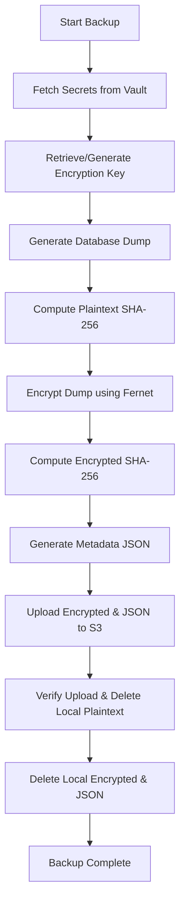
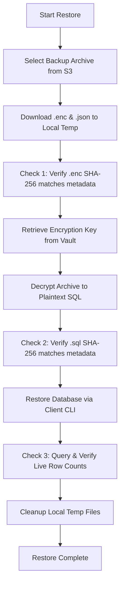

# Database Security: Secure Backup & Restore Procedures

## Overview
This skill provides a standardized, secure blueprint for implementing and executing database backup and restore workflows. It is designed to ensure the confidentiality, integrity, and availability (CIA triad) of database archives using centralized secret management (e.g., HashiCorp Vault), strong symmetric encryption (Fernet/AES-128-CBC), multi-point integrity verification (SHA-256), and remote object storage (S3-compatible).

## Core Principles

1. **Zero Hardcoded Secrets**: All database connection credentials and storage keys must be retrieved dynamically from a secure vault (e.g., HashiCorp Vault, AWS Secrets Manager) at runtime.
2. **Symmetric Encryption**: Plaintext database dumps must be encrypted before being stored in remote repositories.
3. **Multi-Stage Integrity Checking**: Verify file hashes before encryption, after encryption, and after restoration to guarantee that no data corruption or tampering occurred.
4. **Immediate Cleanup**: Plaintext backups must be deleted immediately after a successful upload to minimize the attack surface on local disks.

---

## The Secure Backup Pipeline

The backup process follows a strict 10-step sequence:

### Step-by-Step Implementation Details

#### 1. Secret Retrieval
- **Vault Connection**: Establish an authenticated session with the secrets engine.
- **Data to Fetch**:
  - Database URL / connection string (containing host, username, database name).
  - Storage access/secret keys (e.g., MinIO or AWS S3 credentials).
  - Encryption key references.

#### 2. Key Management
- Retrieve the symmetric encryption key (Fernet key) from the vault.
- If no key exists, generate a cryptographically secure key (e.g., using `Fernet.generate_key()`) and store it back into the vault.

#### 3. Database Dump Generation
- Run the appropriate utility (e.g., `pg_dump` for PostgreSQL, `mysqldump` for MySQL) to write the database content to a local plaintext SQL file in a temporary directory (e.g., `/tmp`).
- Handle subprocess environment variables safely (e.g., set `PGPASSWORD` rather than passing password in the command arguments).

#### 4. Integrity Validation (Pre-Encryption)
- Calculate the SHA-256 checksum of the local plaintext SQL file. This acts as the source-of-truth signature.

#### 5. Symmetric Encryption
- Encrypt the plaintext SQL file using the symmetric Fernet/AES-128-CBC key.
- Save the result as a binary file (e.g., with a `.enc` suffix).

#### 6. Integrity Validation (Post-Encryption)
- Calculate the SHA-256 checksum of the encrypted `.enc` file. This is used to detect corruption during upload/download/storage.

#### 7. Metadata JSON Generation
- Construct a metadata file containing:
  - Timestamp and status.
  - Database type and name.
  - Plaintext dump file size and hash.
  - Encrypted file size and hash.
  - Target row counts (highly useful for validation).
  - Vault reference path of the encryption key.
  - Encryption/hashing algorithms used.

#### 8. Remote Storage Upload
- Upload both the encrypted archive (`.enc`) and the metadata file (`.json`) to the remote S3-compatible bucket.
- Organize backups logically by date, e.g., `backups/YYYY/MM/DD/`.

#### 9. Clean-up & Sanitization
- Confirm that the S3 upload succeeded.
- Securely delete the local plaintext SQL file from `/tmp`.
- Delete the local encrypted file and metadata file.

---

## The Secure Restore Pipeline

A restore must never be done blindly. It uses a three-stage integrity verification process:

### Verification Checks

#### Check 1: Encrypted Archive Integrity
- Compute the SHA-256 hash of the downloaded `.enc` file.
- Compare it to `hash_apres_chiffrement` in the metadata JSON. If it differs, **fail immediately** (corruption during transport or storage tampering).

#### Check 2: Decrypted Dump Integrity
- Decrypt the `.enc` file using the Fernet key from the vault.
- Compute the SHA-256 hash of the resulting plaintext `.sql` file.
- Compare it to `hash_avant_chiffrement` in the metadata JSON. If it differs, **fail immediately** (decryption error or payload corruption).

#### Check 3: Post-Restore Round-Trip / Completeness
- Run the restore command (e.g., pipe the SQL dump to the database client CLI: `psql < db_backup.sql`).
- After the restore runs, query the database's statistics tables (e.g., `pg_stat_user_tables` in PostgreSQL) to sum the live rows across all tables.
- Compare this total against the `total_rows` recorded in the metadata. If it differs, **fail or raise an alert** (restore was incomplete or tables failed to load).

---

## Common Mistakes & Troubleshooting

*   **Failure to clean up plaintext files locally**: Plaintext database dumps left in `/tmp` present a significant security vulnerability if the host is compromised. Always ensure your backup/restore scripts clean up files in a `finally` block.
*   **Assuming pg_dump output is deterministic**: The output of pg_dump changes between runs even on identical data (due to timestamps, internal stats, etc.). Therefore, comparing the SHA-256 hash of a post-restore pg_dump with the pre-backup dump will always fail. Use a row count summation or object count check instead for Check 3.
*   **Failing to handle large files**: When computing SHA-256 hashes or encrypting, read files in chunks (e.g., 8192 bytes) rather than loading the entire file into memory to avoid Out-Of-Memory (OOM) crashes.
*   **Environment Variable Drift**: If cron runs backups as a system service, it may lack the current shell's environment variables. Explicitly load `.env` files or pass credentials via system environment settings.
